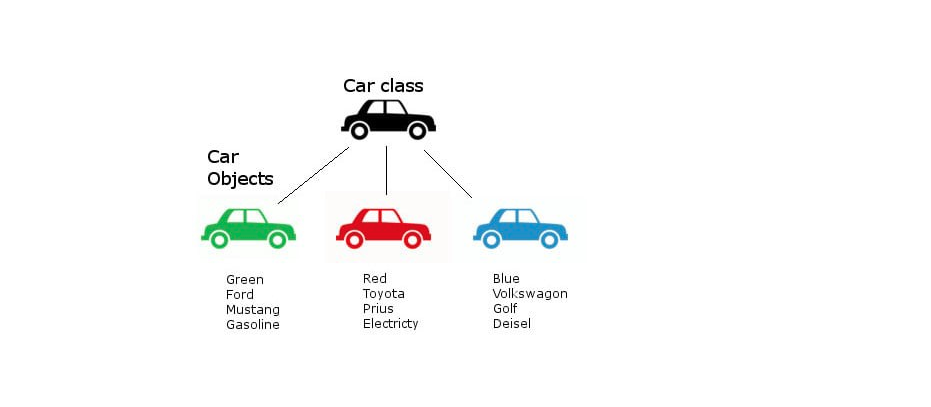

---

## OOP Basics
While traditional procedural programming languages are great to solve many programming problems efficiently they are inherently not good enough to model real world problems.
Because in real world each entity has both - attributes and behaviors. Procedural programming are good to represent attributes of real world entity in a single structure using different data types. For example the number of doors in a `Car` with `int` data type, the color of the `Car` with `String` datatype. But but a car is not all about the collection of these attributes. The car has some behaviors like - it accelerate, it turns left or right. These could not be incorporated into a single structure in procedural programming language. 

OOP (object oriented programming) comes here to solve these problems. OOP represent a real world entity (`Car`, `Student`, `Person`, `Account`... anything you could think) more efficiently by encompassing both attributes and behaviors in a single structure. To represent attributes OOP use different data types like - `int`, `float` etc and to represent behavior OOP use methods like `turnLeft()`, `turnRight()` etc.

To represent these real world object more efficiently OOP introduce 2 new concepts - ***Class*** and ***Object***

### Class and Object
#### Class
A class is the blueprint of a real world entity. Class encapsulates both attributes (via different data types) and behaviors (via methods/functions) of real world's entity in a single structure.

Class also could be think as user defined (or derived) data type. While the programming language provided data type like `int`, `float` etc could represent simple real world data like - number of doors/wheels in a `Car`, age of a person, but they can not represent real world complex data like `Car`. Because car has both - attribute and behaviors. OOP give you the opportunity to make a complex data type for `Car` using class. That's why class is often called user defined data type or derived data type.

#### Object
Object is the instance of class. It is the 

Object could also think as class type data. You define a class - `Car` as your complex data type. Now you can create your own data from that data type `Car` that will reside in memory. 

#### Difference Between Class and Object

Just like you can not drive a blueprint or engineering design of a car you can not use a class directly. Before using class you have to create instance (object) from the class. This object will stay in memory, and you can use it in your program.

| <span style="width=40%">Class</span>                          | <span style="width:40%">Object</span>                           |
| ------------------------------------------------------------- | --------------------------------------------------------------- |
| Class is a template for declaring and creating objects        | An object is an instance of class                               |
| When a class is created, no memory allocated                  | Objects are allocated to memory space whenever they are created |
| Class has to be declared only once                            | An object is created many times per requirements                |
| As class can not be manipulated as they are not in the memory | An object can be manipulated                                    |
| A class is logical entity                                     | An object is physical entity                                    |      


##### Creating Class
```python
class Car:  
    no_of_wheels, no_of_doors = 4, 4  
  
 def __init__(self, color, producer, model, fuel):  
        self.color = color  
        self.producer = producer  
        self.model = model  
        self.fuel = fuel  
  
    def turn(self, direction: str):  
        print(self.model + ':' + 'Turning ' + direction + '...')  
  
    def accelerate(self, factor: float):  
        print(self.model + ':' + 'Accelerating its speed by ' + str(factor) + 'x...')  
  
    def __str__(self):  
        return self.producer + ' ' + self.color + ' ' + self.model + ' ' + self.fuel
```

##### Creating Object
```python
toyota = Car('Red', 'Toyota', 'Prius', 'Electricity')  
  
print('Car:', toyota)  
print('Total wheels:' + str(toyota.no_of_wheels))  
print('Color: ' + toyota.color)  
toyota.accelerate(2.5)  
toyota.turn('left')


OUTPUT:
Car: Toyota Red Prius Electricity
Total wheels:4
Color: Red
Prius:Accelerating its speed by 2.5x...
Prius:Turning left...

```

### Four Pillars of OOP

#### Abstraction
Abstraction allow us only to show the essential things to users. It hides the  details' implementation, trivial or the non-essential units from the users. In other words abstraction is the hiding details and complexities and showing only the necessary part to the users. Its one of the most fundamental concepts of OOP. 
**Example**:  when you login to your email account online, you enter your `user_id` and `password` to login. What happens when you hit login, how the input data sent to server, how it gets verified is all abstracted away from the you.

Data Abstraction may also be defined as the process of identifying only the required characteristics of an object ignoring the irrelevant details. The properties and behaviors of an object differentiate it from other objects of similar type and also help in classifying/grouping the objects.
**Example:** Say you are designing a student management system for a university. You have to model a student's attributes and behaviors in `Student` class. A student in real life may have a lot of attributes like - roll number, registration number, CGPA, SSN, height, weight and so on. Similarly as student might have a lot of behavior like - enrolling himself to a particular course, paying semester fees,  taking part in exam, traveling, listening to musics. 
But abstraction tell us only to take the attributes and behaviors those are relevant to student management system and ignore all others attributes and behaviors. 

#### Encapsulation
As we already know real world entity has both attributes and behaviors. Encapsulation is the ***process of binding these attributes and behaviors in a single entity***. 	If you are creating class, you are doing encapsulation.
To achieve encapsulation OOP language like java do the following  two things - 
- Make the instance variables private so that they cannot be accessed directly from outside the class. You can only set and get values of these variables through the methods of the class.  
- Have `getter` and `setter` methods in the class to set and get the values of the fields.

The whole idea behind encapsulation is to hide the implementation details from users. If a data member is private it means it can only be accessed within the same class. No outside class can access private data member (variable) of other class.
However, if we set up public `getter` and `setter` methods to update the private data fields then the outside class can access those private data fields via public methods.

This way data can only be accessed by public methods thus making the private fields, and their implementation hidden for outside classes. That’s why encapsulation is known as **data hiding.** 

--- 
#### Abstraction vs. Encapsulation
It seems both encapsulation and abstraction hide something from the users but here are some key difference between these two concepts - 
- Encapsulation is **data hiding(information hiding)** while Abstraction is **detail hiding(implementation hiding).**
- While encapsulation groups together data and methods that act upon the data, data abstraction deals with exposing the interface to the user and hiding the details of implementation.
--- 
#### Inheritance
Inheritance is the process by which one class acquires the properties(data members) and functionalities(methods) of another class.  In, inheritance there are 2 class involved - 
- **Parent Class:**  
	- The class whose properties and functionalities are used(inherited) by another class  
	-  also known as super class or base class.
- **Child Class:**  
	- The class that extends the features of another class 
	- also known as child class, subclass or derived class.
- The aim of inheritance is to provide the re-usability of code so that a class has to write only the unique features and rest of the common properties and functionalities can be extended from the another class
- The biggest **advantage of Inheritance** is that the code that is already present in base class need not be rewritten in the child class

#### Polymorphism
- Polymorphism allows you to have multiple methods by the same name.  These same named multiple method could be found in same class or subclasses of a same parent classes.
- Based on this fact where polymorphism will happen, polymorphism could be either of static or dynamic. Method Overloading is static polymorphism while, method overriding is dynamic polymorphism.
	-   **Overloading** Overloading means having multiple method with same method name but with different method signatures. Method signature composed by - (1) method name  (2) number of arguments (3) types of arguments. Method signature dosen't depends on return type. Overloaded methods are resolved at compile time. Compiler decides which method it should actually call from the overloaded methods (multiple method with same name). Its also known as static polymorphism.
	-   **Overriding** Its happen when a derived class **override** the method of a parent class. Say you have a parent class  `Animal` which has a method `makeSound()`.  `Cat` and `Dog` are 2 subclass of the `Animal` class. They both implement the `makeSound()` method by their own way - `Cat` 'Meaw's and `Dog`  'Woof's. Now you can use a reference type say `dog` of `Animal` to store the `Dog` object and another reference type say - `cat` of type `Animal` to store the `Cat` object. 
		- Now if you call the method like this `dog.makeSound()`  you will gate 'Woof'
		- If you call the method `cat.makeSound()` you will get 'Mew'
	- Even both `dog` and `cat` object are subclass of `Animal`  class, and they both implement the same method `makeSound()`but here they are acting differently based on their implementation. This behavior is known as method overriding.
	- Also known as dynamic polymorphism,  or run time polymorphism. 

--- 

## Immutability
- **Immutable Object**
	- An immutable object is one that will not change it's state after it is instantiated. All data contained by the immutable class are provided to the constructor while the object is being created. You can not mutate (or change) them throughout the lifespan of the object.
- **Reason for using Immutable class** 
	- There are many good reason to use immutable classes - they are easy to design, implement, and use than mutable class. They are less prone to error and are more secure.

- **Example** 
	- In  Java platform libraries:   `String`, `BigDecimal`, `BigInteger`, all wrapper types of primitive type (Integer, Long, Double)
### How to make a class immutable?
- Five rules to make a class immutable
	- **Do not provide methods that change the object's state(aka - mutators).**
		- Example of mutators public setter methods
	- **Ensure that class can't be extended**
		- by making it `final`
		- **Why it is important to prevent subclassing for immutable class?** 
			- cause careless or malicious subclass could compromise the immutable behavior of this class
		- alternative of preventing extending class is - to remove public, and default constructors and to provide static instance factory method
	- **Make all fields final**
	- **Make all fields private**
		- Make all fields private - both primitive , and referenced type (eg.- List, Map etc)
			- if you don't make referenced type private, clients from obtaining class could change the value of the referenced type
		- Though it is technically possible for immutable class to ***have public final fields*** - ***containing primitive values*** or ***reference to immutable object***
			- but it is not recommended because it precludes changing the internal representation in a later release
	- **Ensure exclusive access to any mutable components**
		- If your class has any fields that refer to mutable objects (eg. - `List`), ensure that clients of the class can not obtain reference to these objects. 
			- **Never directly initialize mutable reference type data provided by the client**, and **never return reference type data directly from accessors (method)**
				- make **defensive copies** in **constrictors**, **accessors**, `readObject` method.


### Advantage of immutable class
- **Ease of use**
	- Immutable objects are simple. An immutable object can exactly be in one state in which it was created. 
	- Mutable objects, on the other hand could have arbitrarily complex state spaces. 
		- If documentation doesn't provide its very difficult or impossible to use mutable class reliably.
- **Inherent thread safety** 
	- They are inherently thread safe; they do not require **synchronization**. 
		- they can not be corrupted by multiple threads accessing them concurrently - this is far and easiest way of achieving thread safety rather than using synchronization 
	- immutable objects can be shared freely
- **They are great building blocks for other objects - be mutable or immutable.**
	- It's much easier to maintain the **invariants of a complex objects** if you know it's component object will not change underneath.
	- That's why they are great Map key and Set element - you don't have to worry about changing their values that will destroy the map and set's invariants. 
### Disadvantage of immutable class
- **The only real disadvantage of immutable classes is that they require a separate object for each distinct value.** Creating this object can be costly, specially if they are large.
- This cost/performance is magnified if you perform multi steps operations.
	- To solve this problem there are 2 approaches:
		- **First: predict the multistep operations and separate them.**
			- Do the multistep costly operations using primitive. Since primitive objects are mutable you don't have to create multiple objects for each values you generate. 
			- **Example:** `BigInteger` has a package-private mutable "**companion class**" that is used to speed up expensive multistep operations (like - modular exponentiation)
		- **Second: to provide public mutable companion class**
			- The first one is only important when you can predict the multistage client operations. 
			- If you can not predict the multistage client operation correctly you can use public mutable "**companion class**"
			- **Example:** `String` class provide two public mutable "**companion class**" - `StringBuilder`(mostly used, not thread safe, and fast) and `StringBuffer` (largely obsolete, thread safe and slow). 
				- when you need thread safety use `String` rather than using it's mutable companion thread safe class `StringBuffer` 
### Some few more notes on immutability
- there are few exceptions to [above five rules](#how-to-make-a-class-immutable) you should know that could give you some advantage in some situations
	- **Alternative of making class final**
		- making all constructors **private** or **package-private** and add static factories' method in place of public constructors 
			- to the clients those resides outside of the package this class is effectively final (even though you didn't use the final keyword).
				- because it is impossible to extend the class outside from the package due to the lack of **public or protected constructor**
		- adding static factories' method by this way is more flexible and has some benefits
			- adding some code in static factories' method that could be release in later version without hampering the older clients code
				- you could improve performance by allowing caching without affecting client's code
		- adding multiple static factory methods is more elegant  than adding multiple constructor - it's more verbose as well 
		```java
		...
		public Complex (double realPart, double imiginaryPart) {...} # take complex number in (x,y) coordinate format
		public Complex (double r, double theta) {...}  # takes complex numbers in (r, theta) format

		public static Complex ValueOf(double realPart, double imaginaryPart) {...}
		public static Complex ValueOfPlar(double r, double theta) {...}  # more verbose and elegant naming
		```
- **Exception where you could use** (some) **non-final fields** 
	- "To make all fields final" - this rule is bit stronger than necessary.
	- You can add some non-final fields in which they can cache result of the expensive computation.
		- to store hash code of `PhoneNumber` where `PhoneNumber`  is an immutable class


- **Finally**
	- **class should be immutable unless there's  a very good reason to make  them mutable**
		- you should always make small value object such as `PhoneNumber`, `Complex` (number) as immutable
		- you should seriously consider making large value object like `String`, `StringBuilder` immutable as well
		- though in java library there are several classes like `java.util.Date`, `java.awt.Point` that should have been immutable but aren't 
	- provide public mutable companion class for your mutable class ***only when*** you confirmed that it could provide satisfactory performance improvement.
	- there are some classes for which immutability is impractical. If a class can not be immutable limit it's immutability as much as possible.
		- **make every fields final unless there is a compelling reason to make it non-final**
	- constructor should create fully initialized object with all of their invariants established 
    

--- 

## Proof of Algorithms
### Empirical Analysis
- Empirical analysis is not really a proof, it dosen't guarantee the correctness of an algorithm
- But most of the case it's good enough to ensure you that your algorithm will produce correct result for all cases. Its the most practical approach.
- Though it's not a formal approach to proof the correctness of an algorithm is is the most used. Because its easy to use, solid enough in most of the practical case, and the lacking of mathematical knowledge of (most of the) programmer to prove an algorithm in formal way. 
- **How empirical analysis is done?**
	- your algorithm is tested against different critical inputs
	- your algorithm is tested with candidate data from different group of data set (eg- positive integer, negative integer, fraction) and being checked whether it producing the expected results
	- **Example:**  look at the following code that finds maximum values from an array. We are here trying to test our algorithm against different input. This is empirical analysis. Though here we use assertion to check whether the condition holds true in each case if you use your pen and notebook it still empirical analysis.

		```python
		def find_max_val(numbers):  
			max_num = numbers[0]  
			for i in range(0, len(numbers)):  
				if numbers[i] > max_num:  
					max_num = numbers[i]  
			return max_num  

		assert -4 == find_max_val([-13, -4, -24, -7]), 'Max value should be -4'  
		assert 24 == find_max_val([13, 4, 24, 7]), 'Max value should be 24'  
		assert 24 == find_max_val([13, -4, 24, -7]), 'Max value should be 24'  
		assert 99 == find_max_val([5 / 2, -2.22, math.pi, 99]), 'Max value should be 99'
		```
### Formal Proof
#### Mathematical Induction and Loop Invariant
##### Mathematical Induction 
- is a mathematical technique which is used to prove a statement, a formula or a theorem is true for every natural number(N). It consists of two steps
	- **Step 1 (Base step):** Show your statement, **P(n)** is true for some initial case. (usually n=0, 1) 
	- **Step 2 (Induction step):** Show if n=k is true then n=k+1 is also true
- Now you can say your statement **P(n)** is true for all natrual numbers
##### Loop Invariant
```python
def find_factorial(n):  
     fac = 1  
	 for i in range(1, n + 1):  
			fac = fac * i
```
- these are some condition or state that always holds true after the execution of each step of a loop.
- **Example:** if you see the above method in `find_factorial(n)`,  the loop invariant  there are
	- after the end of any **nth** iteration the value of **n** should be **n+1**
	- after the end of any **nth** iteration the value it will gives you **n!**

##### Use of mathematical induction to prove your algorithm correctness
- To prove your algorithm correctness using mathematical induction, you also have to consider about two more thing
	- **firstly**, find the **loop invariant**, then apply mathematical induction on it to check loop invariant is true for all natural numbers
		-  you have to prove that loop invariants is true for some initial value like **n=0, 1...**
		- you have to prove that loop invariant is true for **n=k** AND it will also true for **n=k+1**
	- **secondly**, you have to prove that your algorithm will stop at some value of **n**
- this mathematical induction technique works well for algorithms that loop over integers, and`` can prove that an algorithm always produces correct output. Other styles of proofs can verify correctness for other types of algorithms, like **proof by contradiction** or **proof by exhaustion**.

---

## Coding Exercise
### [Valid Palindrome](https://leetcode.com/problems/valid-palindrome/)
Given a string s, determine if it is a palindrome, considering only alphanumeric characters and ignoring cases.
```python
class Solution:
    def isPalindrome(self, s: str) -> bool:
        char_array = [c.lower() for c in s if c.isalnum()]

        start = 0
        end = len(char_array) - 1
        while start <= end:
            if char_array[start] != char_array[end]:
                return False
            start = start + 1
            end = end - 1

        return True
```
**Complexity**: time O(n), space O(n)

### [Two Sum II](https://leetcode.com/problems/two-sum-ii-input-array-is-sorted/) 
Given an array of integers numbers that is already sorted in non-decreasing order, find two numbers such that they add up to a specific target number.
```python

class Solution:
    def twoSum(self, numbers: List[int], target: int) -> List[int]:
        result = []

        start = 0
        end = len(numbers) - 1
        while start <= end:
            _sum = numbers[start] + numbers[end]
            if target == _sum:
                result = [start + 1, end + 1]
                break
            elif _sum > target:
                end = end - 1
            elif _sum < target:
                start = start + 1

        return result
```
**Complexity**: time O(n), space O(1)

---
