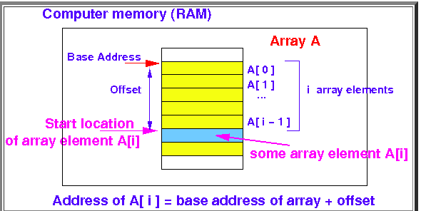
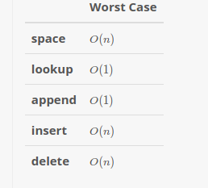
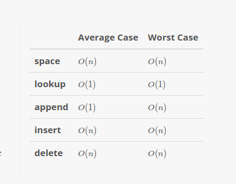
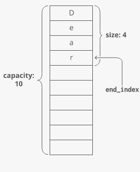
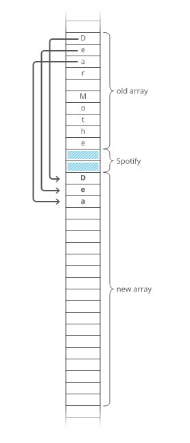

## Array
- Array is the simplest data structure. It represents a collection of items **of same types** stored in at **contiguous memory location.**   
- Each position of an array has an `index` - starting at 0
- If you know the base address of an array and size of each element the array contains then you can find the any element from the array
- 
	- $offset to A[i]=ixsize(one array element)$
- **Operations on array**
	- lookup
	- append
	- insert
	- pop
	- delete
- **Strength**
	- **Fast lookup** 
		- retrieving the element at a given index takes O(1)O(1) time, regardless of the length of the array.
	- **Fast append**
		- adding a new element at the end of the array takes O(1)O(1) time, if the array has space.
	- **Random access**.
		- using the index number you can access any element from the array - no matter whether the element is at the star/mid/end of the array
- **Weakness**
	- **Fixed size** 
		- You need to specify how many elements you're going to store in your array ahead of time. (Unless you're using a fancy [dynamic array](#dynamic-array).)
	- **Costly insertion and delete**
		- You have to ["scoot over" the other elements to fill in or close gaps], which takes worst-case O(n)O(n) time.
- **Cost of different operations in array**
	- 

### Implementation in popular programming languages
- **Java**

	```Java
	int n1[]; //declaring array
	int[] n2; //another way of declaring array

	n1 = new int[10]; //initializing
	n2 = new int[20]; //initializing

	int[] n3 = new int[30]; //both declaring and initializing
	```
- **Python**
	 - Python core dosen't provide any fixed size array, rather it provides you dynamic array which is list
--- 

## Dynamic Array
- One problem with array is that we have to say the size of the array while creating the array. But often while creating an array we don't know the how many elements there will be in the array. Dynamic array solves this problem - you don't need to mention the size of the array while creating the array. The size of the array grows when needed. 
- **Operations on array**
	- lookup
	- append
	- insert
	- pop
	- delete
- **Strength**
- **Weakness**
- **Cost of different operations**
	- 

### How does dynamic array work?
#### Size vs. Capacity
When you allocate a dynamic array, your dynamic array implementation makes an _underlying fixed-size array_. The starting size depends on the implementation—let's say our implementation uses 10 indices. Now say we append 4 items to our dynamic array. At this point, our dynamic array has a length of 4. But the _underlying array_ has a length of 10.

We'd say this dynamic array's **size** is 4 and its **capacity** is 10. The dynamic array stores an **end_index** to keep track of where the dynamic array ends and the extra capacity begins.



#### Doubling Appends

What if we try to append an item but our array's capacity is already full?
To make room, dynamic arrays automatically make a new, bigger underlying array. Usually twice as big.

>**Why not just _extend_ the existing array? **
>Because that memory might already be taken by another program.

Each item has to be individually copied into the new array.



Copying each item over costs O(n)O(n) time! So whenever appending an item to our dynamic array forces us to make a new double-size underlying array, that append takes O(n)O(n) time.
That's the _worst_ case. But in the best case (and the _average_ case), appends are just O(1)O(1) time.
### Implementation in popular programming languages
- **Java**
	```Java
	List<Integer> n = new ArrayList<>(); //no need tomention the size;
	List<String> s = new ArrayList<>();

	n.add(25); //appending element
	n.add(2, 34); /adding 34 at index 2

	```
- **Python**
	```Python
	lst1 = [] //empty list
	lst2 = [1, 2, 98, 38, 32] 
	lst3 = [23, 'a', 95, 'b'] //python list can ontaint different types of data, cause everything in python is object
	
	print(lst2[2]) // lookup
	
	lst1.append(33) //append
	lst1.append(35)
	
	vowels=['a', 'e', 'o', 'u']
	vowels.insert(2, 'i') //inserting element at index position 2, it will not remove any elment that previously was in index 2 ('o'). It will shift all elements after index 2
	
	lst2.pop() //remove the last element(32) from the list
	list2.pop(2) //remove the element at index 2, which is 98
	
	lst4 = ['book', 'pen', 'pencil', 'note-book']
	lst4.remove('book') //removing element by item - removing specific element

	
	```
## Coding exercise