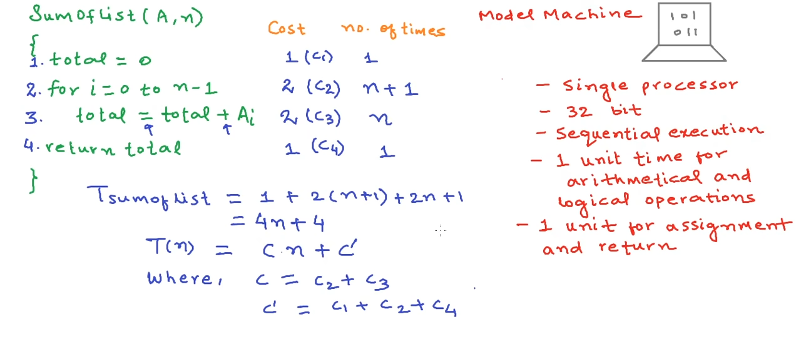
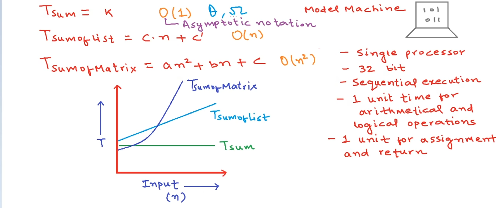
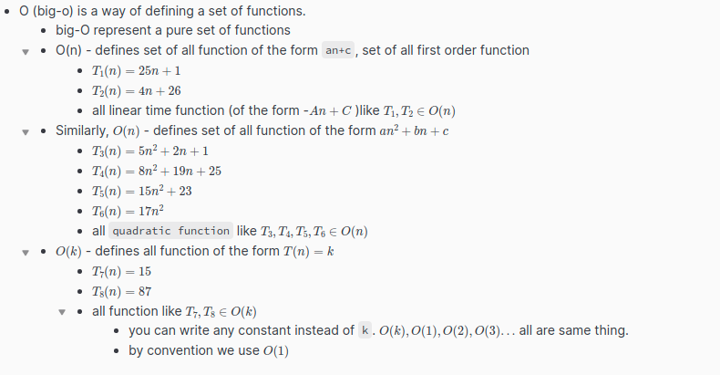
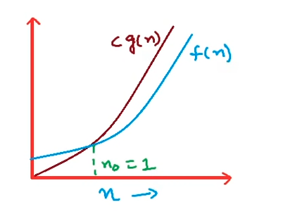
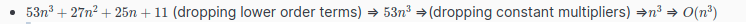
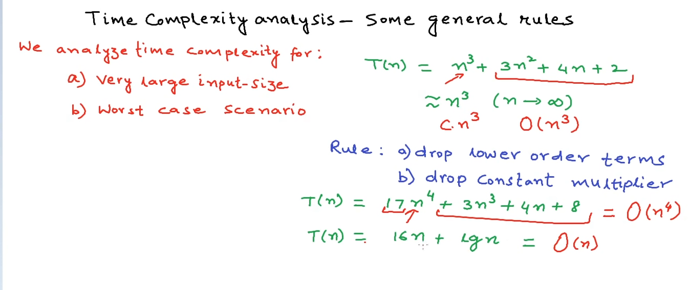
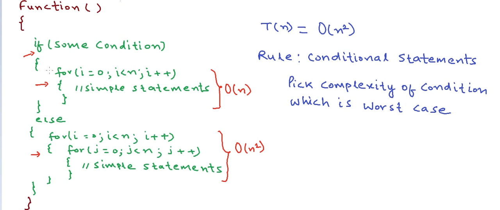
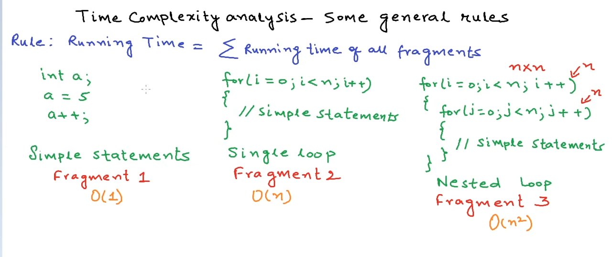
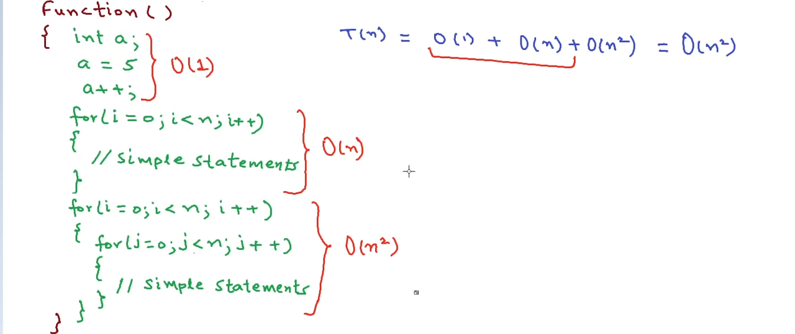

# Complexity Analysis

### How complexity analysis done?
- The actual running time of computer programs or algorithms depends on various factors like - 
	- the processor - the number of processor/core used in your computer, clock speed of the processor
	- time to write into memory and read from memory
	- how the computer processing instructions - sequential or multiple concurrent instructions
	- **the volume of input** data
 - all of the above from the list except **the volume of input** data depends on particular type of computer and hardware implementation. So to judge the efficiency of an algorithm considering these factor will not be wise. If we want to compare the efficiency of different algorithm we only consider the volume of input. 
#### The model machine concept
-	since everyone is using different machine, calculating the actual running time in seconds for different algorithm is not possible. So a model machine concept is introduced to deduce the running time of a algorithm in seconds. All algorithm is run on this machine to get approximate time.
-	
	-	**NOTE**: 
		-	besides each line we write the cost of complexity according to the model machine
			-	at line 1 assignment takes 1 unit time
			-	at line 2 there are 2 operations - comparison and increments so it takes 2 seconds
		-total time `T``sumoflist``=1+2(n+1)+2n+1`
			- at line 2 there is `n+1` comparison because there 1 extra comparison for the false condition
			- 1, 2, 2, 1 are constant
		- often while you want to ignore the constant the expression could (the second one in the above image) be written like `Cn+C'` 

### The time function T(n) graph, and relation between big-o notation and time function T(n)
- In the above section we've deduce time function `T(n)` for our model computer. Most often we don't use these long calculation, cause we are only interested about the rate of growth of the function. In that case big-o notation is used.

- **NOTE:**
  

### Complexity analysis - some general rules
- 
	
 - **Rules to calculate complexity from $T(n)$ expression:** (based on the above fact)
	 - from the time function, drop all the lower order terms
	- from the time function, drop all constant constant multipliers
	- now take only the higher order term, and that will be your complexity 
	- **Example:**
		
		

- **Some simplification rules of $O(n)$**
	- if your code have multiple branches (due to the if else) to execute and each branch has different time complexity ==> complexity ==> complexity of the larger branch
		- 
	-  if you algorithm has multiple code fragment of different order of complexity sum them up and simplify
		- $O(n) + O(n^2) + O(1)$ (summing up simplify)==> $O(n^2)$
		- **Example:**
		-  

- **General rules summary:**
	- drop the lower order terms from the expression
	- drop the multiplying constants from the expression 
	- pick the higher order while your code has multiple fragments of different complexity  
	- pick the higher order from if/else/switch branches

